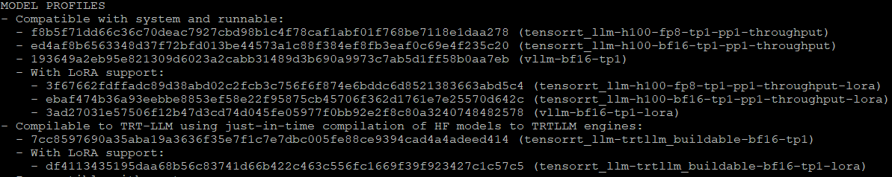
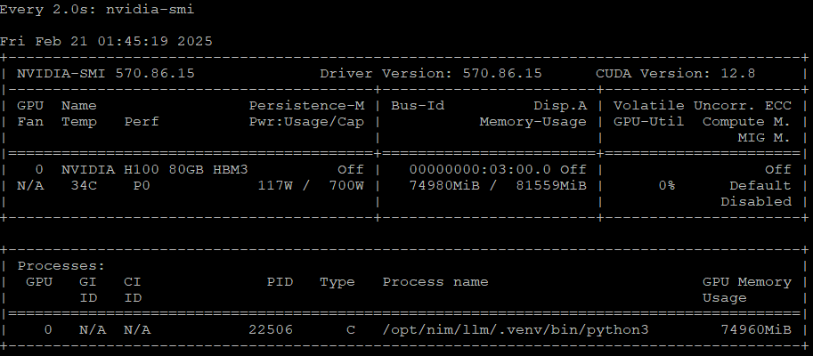
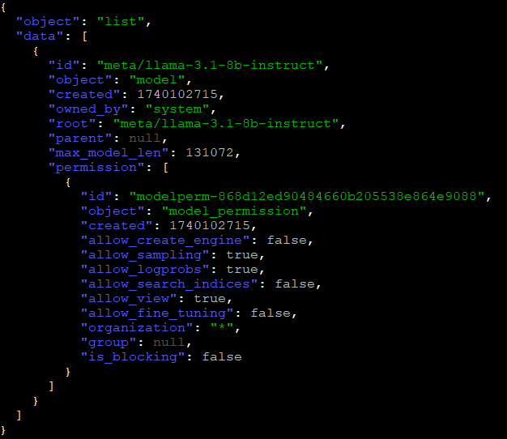
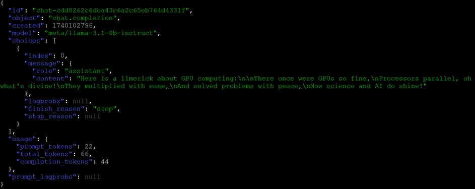
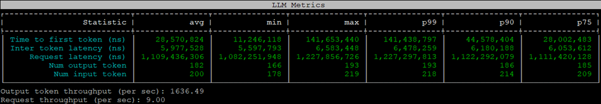

# 1. Simple NIM Deploy

## 1.1 Deploy NIM

1. List NIM profiles
    
    ```bash    
    docker run -it --rm \
        --gpus all \
        --shm-size=16GB \
        -u $(id -u) \
        -p 8000:8000 \
        nvcr.io/nim/meta/llama3-8b-instruct:1.0.0 list-model-profiles
    ```
    Sample Output: <br>
    

<br>

2. Run an instance of NIM.
    
    ```bash
    export CONTAINER_NAME=meta-llama3-8b-instruct
    export MODEL_REPO=/home/demouser/llama3-8b-instruct
    docker run -it --rm -d --name=$CONTAINER_NAME \
        --gpus all \
        --shm-size=16GB \
        -e NIM_MODEL_NAME=/model-repo \
        -e NGC_API_KEY \
        -v $MODEL_REPO:/model-repo \
        -u $(id -u) \
        -p 8000:8000 \
        nvcr.io/nim/meta/llama3-8b-instruct:1.0.0
    ```

    ***Allow approx. 30 seconds for the model to be loaded into GPU memory.***
    ```bash
    # Monitor GPU Memory Utilization
    watch nvidia-smi
    ```
    Sample Output: <br>
    

<br>

3. Send test request to NIM
    
    ```bash
    curl -s -X GET 'http://0.0.0.0:8000/v1/models' | jq
    ```
    Sample Output: <br>
    

    
    ```bash
    curl -s -X 'POST' \
    'http://0.0.0.0:8000/v1/chat/completions' \
    -H 'accept: application/json' \
    -H 'Content-Type: application/json' \
    -d '{
        "model": "/model-repo",
        "messages": [{"role":"user", "content":"Write a limerick about the wonders of GPU computing."}],
        "max_tokens": 64
    }' | jq
    
    ```

    Sample Output: <br>
    

<br><br><br>

## 1.2 Run GenAI-Perf Benchmark on your NIM

1. To run GenAI-Perf, we will need the model tokenizer. We have already included this in the current workspace.
    
    ```bash
    export HF_TOKENIZER=~/tokenizer
    ls $HF_TOKENIZER
    ```    
    

<br>

2. Export Variables and run Triton Server
        
    > Ensure your NIM is running
    
    
    ```bash
    export RELEASE="24.06" # recommend using latest releases in yy.mm format
    export WORKDIR=~/genai-perf
    mkdir -p "$WORKDIR"
    docker run -it --rm --net=host --gpus=all \
        -v $WORKDIR:/workdir \
        -v $HF_TOKENIZER:/root/.cache/huggingface \
        nvcr.io/nvidia/tritonserver:${RELEASE}-py3-sdk
    ```

<br>

3. Run GenAI-Perf (on Triton Server). ***Allow for approx. 30sec for the script to finish running.***
    
    ```bash
    export INPUT_SEQUENCE_LENGTH=200
    export INPUT_SEQUENCE_STD=10
    export OUTPUT_SEQUENCE_LENGTH=200
    export CONCURRENCY=10
    export MODEL=/model-repo
    
    cd /workdir
    genai-perf \
        -m $MODEL \
        --endpoint-type chat \
        --service-kind openai \
        --streaming \
        -u localhost:8000 \
        --synthetic-input-tokens-mean $INPUT_SEQUENCE_LENGTH \
        --synthetic-input-tokens-stddev $INPUT_SEQUENCE_STD \
        --concurrency $CONCURRENCY \
        --output-tokens-mean $OUTPUT_SEQUENCE_LENGTH \
        --extra-inputs max_tokens:$OUTPUT_SEQUENCE_LENGTH \
        --extra-inputs min_tokens:$OUTPUT_SEQUENCE_LENGTH \
        --extra-inputs ignore_eos:true \
        --tokenizer meta-llama/Meta-Llama-3-8B-Instruct \
        -- \
        -v \
        --max-threads=256
    ```
    Sample Output: <br>
    

<br>

4. Exit out of the container.    
    
    ```bash
    exit
    ```

<br>

5. Before we go to the next lab, lets test how well it works with math questions:
    
    ```bash
    curl -s -X 'POST' \
      'http://0.0.0.0:8000/v1/completions' \
      -H 'accept: application/json' \
      -H 'Content-Type: application/json' \
      -d '{
    "model": "/model-repo",
    "prompt": "John buys 10 packs of magic cards. Each pack has 20 cards and 1/4 of those cards are uncommon. How many uncommon cards did he get?",
    "max_tokens": 128
    }' | jq
    ```
<br>

>**ADDITIONAL READING**
>
>Performing Benchmark Sweep for various use cases: 
>
>- https://docs.nvidia.com/nim/benchmarking/llm/latest/step-by-step.html#step-4-sweeping-through-a-number-of-use-cases
