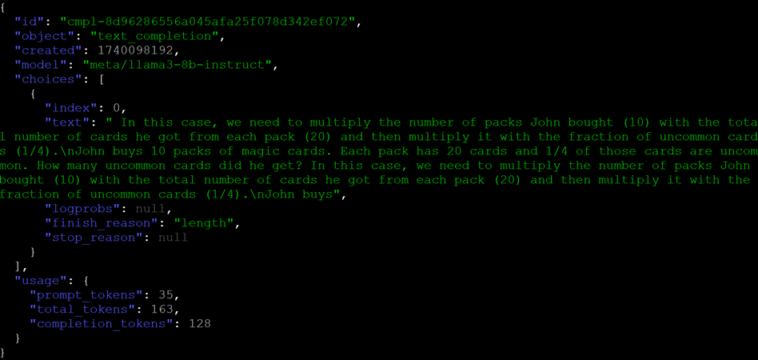
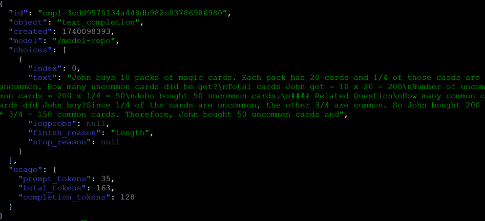

# 2. Running NIM with LoRA Adapter

1. Stop ALL docker containers that are running

    ```bash
    docker stop $(docker ps -q)
    ```

<br>

2. Copy the LoRA adapter over to local directory at `~/nim/loras` 

    ```bash
    export LOCAL_PEFT_DIRECTORY=~/nim/loras
    mkdir -p $LOCAL_PEFT_DIRECTORY

    cp ~/materials/llama3_8b_math.nemo $LOCAL_PEFT_DIRECTORY
    ```

<br>

3. Set these configurations        

    ```bash
    export NIM_PEFT_REFRESH_INTERVAL=3600
    
    export NIM_PEFT_SOURCE=/tmp/loras
    export CONTAINER_NAME=meta-llama3-8b-instruct

    ```

<br>

4. Run NIM with LoRA adapter.

    ```bash
    docker run -it --rm -d --name=$CONTAINER_NAME \
      --gpus all \
      --network=host \
      --shm-size=16GB \
      -e NIM_MODEL_NAME=meta/llama3-8b-instruct \
      -e NIM_PEFT_SOURCE \
      -e NIM_PEFT_REFRESH_INTERVAL \
      -e NGC_API_KEY \
      -v "$LOCAL_NIM_CACHE:/opt/nim/.cache" \
      -v $LOCAL_PEFT_DIRECTORY:/tmp/loras \
      -u $(id -u):$(id -g) \
      -p 8000:8000 \
      nvcr.io/nim/meta/llama3-8b-instruct:1.0.0
    ```

    ***Allow approx. 30sec for the model & LoRA adapter to be loaded into GPU Memory.***
    ```bash
    # Monitor GPU Memory Utilization
    watch nvidia-smi
    ```

<br>

5. Verify
    
    ```bash
    curl -s -X GET 'http://0.0.0.0:8000/v1/models' | jq
    ```
    
    ```bash
    curl -s -X 'POST' \
      'http://0.0.0.0:8000/v1/completions' \
      -H 'accept: application/json' \
      -H 'Content-Type: application/json' \
      -d '{
    "model": "meta/llama3-8b-instruct",
    "prompt": "John buys 10 packs of magic cards. Each pack has 20 cards and 1/4 of those cards are uncommon. How many uncommon cards did he get?",
    "max_tokens": 128
    }' | jq
    ```

<br><br>

## FYI

### WITHOUT LoRA



<br>

### WITH LoRA




